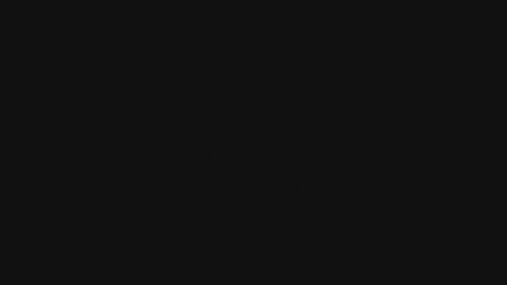
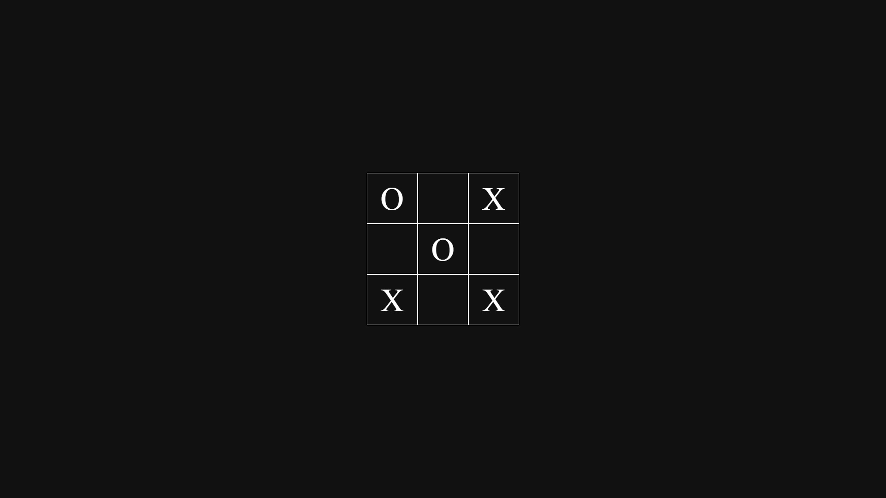
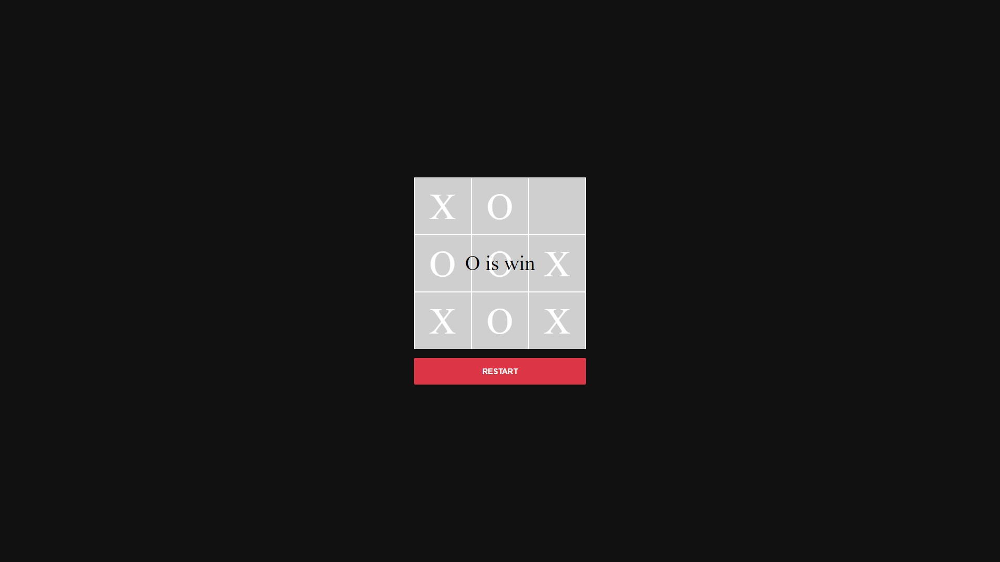
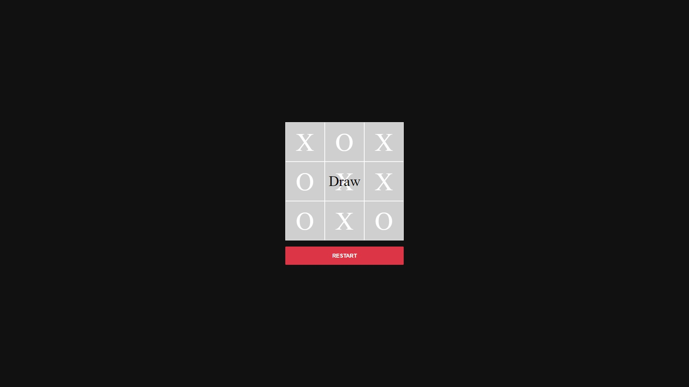

# Tic-Tac-Toe Oyunu

Bu proje, JavaScript Tic-Tac-Toe oyununu içerir. Oyun, iki oyuncu arasında oynanır ve bir kullanıcı arayüzü kullanarak etkileşimli bir şekilde oynanır.

## Nasıl Oynanır

1. Oyunu oynamak için https://vedategunduz.github.io/ticktacktoe/ ziyaret edin.
2. Oyun yüklendiğinde, iki oyuncudan biri "X" sembolünü, diğeri ise "O" sembolünü alır.
3. Oyuncular sırayla kendi sembolleriyle boş hücrelere tıklarlar.
4. Bir oyuncu üç sembolü yatay, dikey veya çapraz olarak hizalayabilirse, o oyuncu kazanır.
5. Eğer tüm hücreler dolarsa ve hiçbir oyuncu kazanamazsa, oyun berabere biter.

## Proje Dosyaları

- `/index.html`: Oyunun HTML dosyası.
- `assets/css/style.css`: Oyunun CSS dosyası.
- `assets/js/script.js`: Oyunun JavaScript dosyası.

## Gereksinimler

Bu uygulama için herhangi bir harici bağımlılık gerekmez. Ancak, JavaScript'in etkin olduğu bir tarayıcı gereklidir.

## Ekran Görüntüleri

